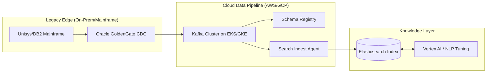

# Mia iaC Azure AWS GCP

## 🏗️ Overview
This repository is a **Multi-Cloud Enterprise Landing Zone** and **Intelligence Hub** PoC. It is architected for high-compliance sectors (Financial Services/Government) to demonstrate the implementation of a secure "Enterprise Search Nervous System."

By bridging legacy data sources (Mainframe/DB2) with modern AI-driven search (Elasticsearch/Vertex AI), this project showcases a "Security-First" approach to knowledge management and automated infrastructure remediation.

## 🗺️ Architectural Blueprint

### 1. Hybrid Search Nervous System (The Ingestion Flow)
This diagram illustrates how we ingest complex, legacy data (like your SBA project experience) and stream it into a unified search index with full security inheritance.

---

## 🛡️ Security & Compliance (The Shield)

*   **Identity Mapping:** Implements **Document-Level Security (DLS)** by mirroring **Access Control Lists (ACLs)** from source systems directly into the Elasticsearch index, ensuring users only see authorized content.
*   **Data Sovereignty:** Utilizes **Terraform** to enforce strict, region-specific residency and localized encryption for all indexed content and metadata.
*   **PII Stripping:** Features an automated ingestion layer for **field-level scrubbing** of sensitive data (PII) before it enters the search index, adhering to **NIST-800-53** standards.

---

## 🚀 Deployment

1.  **Initialize Cloud Credentials:** Configure your local environment by creating a `.env` file based on the provided `.env.example` template to manage project IDs, regions, and service account details securely.
2.  **Infrastructure Orchestration:** Execute `terraform apply` from the `terraform/environments/dev` directory to provision the hardened GKE private clusters, Shared VPC networking, and necessary IAM roles.
3.  **Search Ingest Agent:** Deploy the Go/Python-based `search-ingest-agent` to initialize the data synchronization pipelines and begin indexing enterprise content into the knowledge platform.
4. 